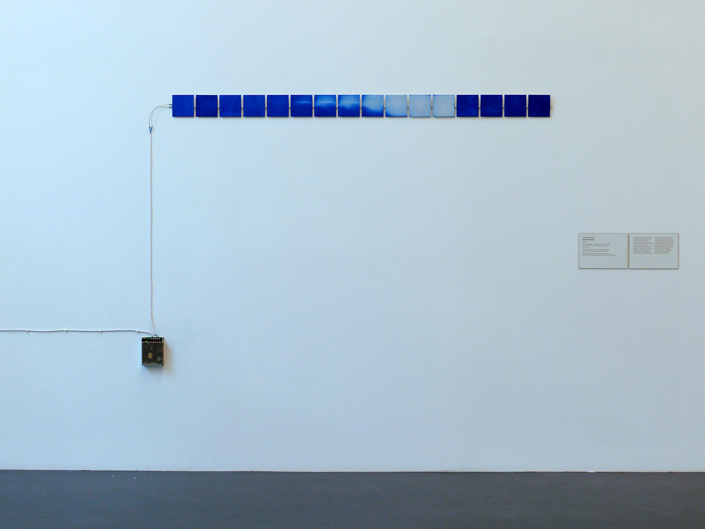

# Bitshift

Thibault Brevet, 2015.

Bitshift explores the physical manifestation of information. An array of black 10x10cm Printed Circuit Boards is arranged horizontally against the wall. An input signal is sent through the left-most module. As the signalling bit shifts from one module to another, it triggers an optical change in the devices. Embedded in the PCBs are resistive heating zones coated with a thermochromic agent. As the boards warm up they initiate a change in the pigment, the black top-coat reveals the white surface underneath for a brief moment, and then forwards the signal down the chain. As the boards cool down they fade back to black.

This project has been produced in the context of [Re-programmed art: an open manifesto](http://www.reprogrammed-art.cc/).

### Technical details

PCBs have been sent to the fab house specifying a white soldermask, 35um copper thickness, all rest is standard. PCBs heating panel is designed to act as a 4 Ohm resistor, with a 12V power supply it sinks 3A and dissipates about 36W and warms 20°C above a target 21°C ambient temperature. The thermochromatic pigment used has a threshold temperature of 33°C, in line with the heating panel max temperature of 41°C.
