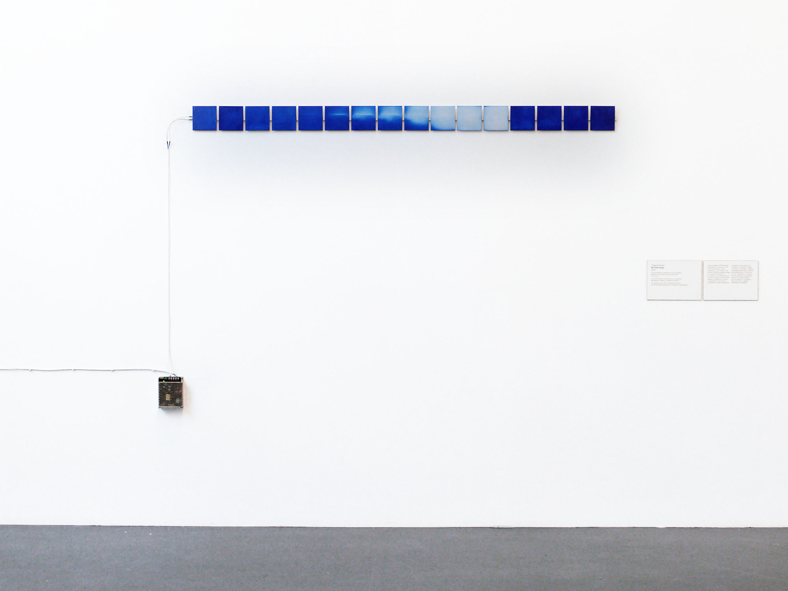

# Bitshift

Thibault Brevet
Bitshift, 2015

16 printed circuit boards (10x10cm PCB, white soldermask), blue thermochromatic pigment, power supply.

Bitshift explores the physical manifestation of a digital signal bit shifting along autonomous modules. Each module integrates electronic on the back-side able to register an input signal. When triggered, each module switches on an integrated heating pattern traced on its front-side. When reaching 37°c, the blue thermochromatic pigment turns transparent, revealing the white undercoating. After executing the heating sequence, a pulse is sent to the next module. The pigment eventually fades back to blue as it cools down.

On view during [Re-programmed Art: An Open Manifesto](http://www.reprogrammed-art.cc/) at Swiss Institute in Milan, IT.

### Technical details

PCBs have been sent to the fab house specifying a white soldermask, 35um copper thickness, all rest is standard. PCBs heating panel is designed to act as a 4 Ohm resistor, with a 12V power supply it sinks 3A and dissipates about 36W and warms 20°C above a target 21°C ambient temperature. The thermochromatic pigment used has a threshold temperature of 37°C, in line with the heating panel max temperature of 41°C.
